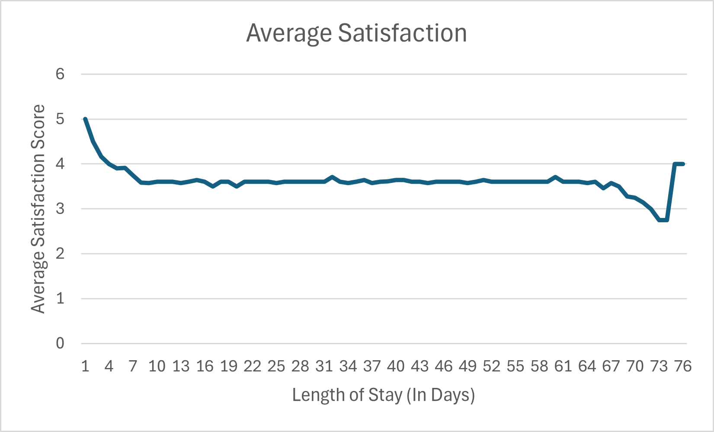

# Patient Data Analysis

## Table of Contents
- [Overview](#overview)
- [Questions](#questions) 
- [Findings](#findings)
- [Dashboard Imagery](#dashboard-images)

## Overview
**Tableau Dashboard -** [Link]()

**Dataset -** When looking for a dataset with some depth where I could derive insights with the caveat of it being already well-maintained, I came across this [Patient Dataset](https://www.kaggle.com/datasets/blueblushed/hospital-dataset-for-practice) and knew it would be a great fit for this project. This dataset is a historical record of patients being seen at a hospital with many demographic variables.

**My Rationale For Choosing This Dataset -** The reason I decided on this dataset is because I wanted to build a project with a different type of data than my other projects, and I feel that the insights that can be derived from analyzing healthcare data is both applicable and very useful for hospitals and patients alike to know. 

***This dataset includes a number of fields including:***
- Patient_Id
- Age
- Gender
- Procedure: The procedure undertaken
- Cost: Cost of said procedure
- Length of Stay (in days)
- Readmission (Yes or No)
- Outcome (Recovered or Stable)
- Satisfaction (Ranging from 1-5)

## Questions

**1.** What are the most prevalent conditions among different age groups?

**2.** Is there a correlation between length of stay and satisfaction?

**3.** Which conditions have the highest readmission rates?

**4.** How does patient satisfaction differ between those with positive and negative outcomes?

**5.** What is the average cost per condition?

**6.** What is the average cost for the highest five and lowest five satisfaction scores?

**7.** How do patient satisfaction scores vary by gender for different conditions?

**8.** Which procedures have the highest success rates?

**9.** Do low satisfaction scores correlate with negative outcome probabilites?

**10.** What is the most common procedure and associated cost by gender?

## Findings

## 1. Conditions Become More Serious With Age ##
First, I started with this initial query below to determine the total range of the ages in the dataset and the corresponding count of the number of patients being that age. WHich allowed me to determine the range is between 25-78, with there being 22 ages total. I will make the three classes for this question seven ages, with the final band having eight since the ages are closer.

``` SQL
select age, count(*) as numberofpatients
from data
group by age
order by age asc;
```

| age | numberofpatients |
|-----|------------------|
| 25  | 34               |
| 28  | 32               |
| 30  | 33               |
| 32  | 33               |
| 35  | 65               |
| 40  | 34               |
| 45  | 66               |
| 48  | 32               |
| 50  | 33               |
| 52  | 65               |
| 53  | 33               |
| 55  | 98               |
| 58  | 33               |
| 60  | 65               |
| 62  | 33               |
| 65  | 64               |
| 67  | 32               |
| 68  | 33               |
| 70  | 33               |
| 72  | 33               |
| 75  | 34               |
| 78  | 66               |


Next, I used the three classes of (25-45), (48-60), and (62-78) to query for the frequency of each type of condition. Below are the results. I found these results to be quite intuitive and they seem almost obvious once being revealed. As we can see below, the 25-45 age group has a high frequency of accidents/injuries that could be more easily preventable, and naturally, childbirth. While as you continue to progress through the results, we find that the conditions become more and more severe as well as less-easily prevented. 

``` SQL
SELECT
  CASE
    WHEN age BETWEEN 25 AND 45 THEN '25-45'
    WHEN age BETWEEN 48 AND 60 THEN '48-60'
    WHEN age BETWEEN 62 AND 78 THEN '62-78'
    ELSE 'Other'
  END AS age_group,
  data.condition,
  COUNT(*) AS count
FROM data
WHERE age BETWEEN 25 AND 45 OR age BETWEEN 48 AND 60 OR age BETWEEN 62 AND 78
GROUP BY age_group, data.condition
ORDER BY age_group, count DESC;
```
| age_group | condition             | count |
|-----------|-----------------------|-------|
| 25-45     | Fractured Leg         | 67    |
| 25-45     | Fractured Arm         | 66    |
| 25-45     | Allergic Reaction     | 66    |
| 25-45     | Childbirth            | 65    |
| 25-45     | Appendicitis          | 32    |
| 25-45     | Heart Disease         | 1     |
| 48-60     | Cancer                | 66    |
| 48-60     | Respiratory Infection | 65    |
| 48-60     | Kidney Stones         | 65    |
| 48-60     | Heart Disease         | 64    |
| 48-60     | Appendicitis          | 34    |
| 48-60     | Osteoarthritis        | 32    |
| 48-60     | Prostate Cancer       | 32    |
| 48-60     | Diabetes              | 1     |
| 62-78     | Heart Attack          | 67    |
| 62-78     | Stroke                | 66    |
| 62-78     | Hypertension          | 66    |
| 62-78     | Diabetes              | 64    |
| 62-78     | Prostate Cancer       | 33    |
| 62-78     | Osteoarthritis        | 32    |

## 2. There is No Strong Correlation Between Length of Stay and Satisfaction ##
For this question, I wanted a simple query that would allow us to see top and bottom 10 values of the length of stay variable to determine if there is a connection. The reason I am limiting the query I am inserting into this, is because there would be roughly 70 rows. However, below I have the query along with its shortened result, and a graph based on the entirety of the data. As we can see there seems to be a small connection based on the query, but when looking at the whole graph, it seems any point beyond a few days loses the extra bonus of satisfaction I would attribute to speed.

``` SQL
SELECT length_of_stay, AVG(satisfaction) as "Average Satisfaction"
FROM data 
WHERE length_of_stay BETWEEN 1 AND 10 OR (length_of_stay BETWEEN 65 AND 75)
GROUP BY length_of_stay
ORDER BY length_of_stay asc;
```
| length_of_stay | Average Satisfaction |
|----------------|----------------------|
| 1              | 5.0000               |
| 2              | 4.5000               |
| 3              | 4.1667               |
| 4              | 4.0000               |
| 5              | 3.9000               |
| 6              | 3.9091               |
| 7              | 3.7500               |
| 8              | 3.5833               |
| 9              | 3.5714               |
| 10             | 3.6000               |
| 65             | 3.6000               |
| 66             | 3.4615               |
| 67             | 3.5714               |
| 68             | 3.5000               |
| 69             | 3.2727               |
| 70             | 3.2500               |
| 71             | 3.1429               |
| 72             | 3.0000               |
| 73             | 2.7500               |
| 74             | 2.7500               |
| 75             | 4.0000               |



## Dashboard Images
